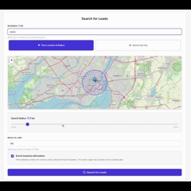

# Local Leads Finder

<p align="center">
  
</p>

<!-- <p align="center">
  <a href="https://pypi.org/project/leads-finder/">
    
  </a>
</p> -->

**Fast, scalable local business lead generation powered by [Decodo](https://visit.decodo.com/RGrYdR) Web Scraping API.**

Turn a simple keyword and location into a ready-to-use dataset of local businesses from Google Maps. Perfect for freelancers, agencies, and SMBs who need quality leads at scale.

## Table of Contents

- [Quick Start](#quick-start)
  - [Option 1: Use the hosted web app (recommended)](#option-1-use-the-hosted-web-app-recommended)
  - [Option 2: Run locally](#option-2-run-locally)
    - [Step 1: Installation](#step-1-installation)
    - [Step 2: Get Decodo credentials](#step-2-get-decodo-credentials)
    - [Step 3: Configure environment (CLI only)](#step-3-configure-environment-cli-only)
    - [Step 4: Start collecting leads](#step-4-start-collecting-leads)
- [Usage](#usage)
  - [Web Interface](#web-interface)
  - [Command Line Interface](#command-line-interface)
- [Output Format](#output-format)
- [Docker Usage](#docker-usage)
  - [Build the image](#build-the-image)
  - [Run the CLI inside Docker](#run-the-cli-inside-docker)
  - [Run the web interface inside Docker](#run-the-web-interface-inside-docker)
  - [API Request Example](#api-request-example)
- [Future Features](#future-features)
- [Contributing](#contributing)
- [Author](#author)

## Quick Start

### Option 1: Use the hosted web app (recommended)

- Visit [Local Leads Finder](https://local-leads-finder.com) website to use Local Leads Finder instantly.
- Enter your Decodo username and password directly in the UI when prompted.
- Start a search and download results without any local setup.

### Option 2: Run locally

#### Step 1: Installation

```bash
# Clone the repository
git clone https://github.com/yourusername/local-leads-finder.git
cd local-leads-finder

# Install dependencies
pip install -r requirements.txt

# Or install as a package
pip install -e .
```

#### Step 2: Get Decodo credentials

Get your Scraper API credentials from [Decodo Dashboard](https://visit.decodo.com/RGrYdR):

1. Navigate to **"Scraper"** tab
2. Find your **username** and **password**

#### Step 3: Configure environment (CLI only)

**Note:** The web interface has its own credential management - users enter credentials directly in the UI.

For CLI usage, create a `.env` file:

```bash
# Create .env file
cp .env.example .env

# Add your credentials
echo "DECODO_USERNAME=your_username" >> .env
echo "DECODO_PASSWORD=your_password" >> .env
```

#### Step 4: Start collecting leads

**Option A: Web Interface**

```bash
cd webapp
python app.py
```

Check the terminal output for the exact URL (default is `http://localhost:5000`, but another free port may be used) and open it in your browser.

**Option B: Command Line**

```bash
leads-finder --query "dentist" --city "Toronto" --out leads.csv
```

## Usage

### Web Interface

The web interface provides a modern, user-friendly way to find leads:

1. **Start the web server:**
   ```bash
   cd webapp
   python app.py
   ```

2. **Open your browser** to the URL printed in the terminal (defaults to `http://localhost:5000`, but may vary if that port is in use)

3. **Fill in the search form:**
   - Business Type (e.g., "dentist", "pizza restaurant")
   - Location with a given radius to look around
   - City (e.g., "Toronto", "New York")
   - Results Limit (1-1000)
   - Country (optional)

4. **Watch real-time progress** as leads are collected

5. **View results** in an interactive table

6. **Export to CSV or JSON** with one click

### Command Line Interface

### Basic Examples

```bash
# Find dentists in Toronto
leads-finder --query "dentist" --city "Toronto" --out toronto_dentists.csv

# Find pizza places in New York (200 results)
leads-finder --query "pizza" --city "New York" --limit 200 --out nyc_pizza.csv

# Find plumbers in Montreal
leads-finder --query "plumber" --city "Montreal" --out montreal_plumbers.csv
```

### CLI Options

```bash
leads-finder --help
```

| Option | Description | Default |
|--------|-------------|---------|
| `--query` | Search keyword (e.g., "dentist", "pizza") | Required |
| `--city` | Target city name | Required |
| `--limit` | Max results to collect | `100` |
| `--out` | Output file (CSV or JSON) | `leads.csv` |
| `--rps` | Requests per second rate limit | `1.0` |
| `--username` | Decodo username | `DECODO_USERNAME` env var |
| `--password` | Decodo password | `DECODO_PASSWORD` env var |

### Batch Processing

```bash
# Process multiple cities
for city in "Toronto" "Montreal" "Vancouver"; do
  leads-finder --query "dentist" --city "$city" --out "dentists_$city.csv"
done
```

### Export to JSON

```bash
leads-finder --query "gym" --city "Los Angeles" --out gyms.json
```

## Output Format

CSV file with the following columns:

| Field | Description |
|-------|-------------|
| `name` | Business name |
| `category` | Primary category or type |
| `phone` | Contact number |
| `website` | Business website |
| `rating` | Google Maps rating (1-5) |
| `reviews_count` | Number of reviews |
| `address` | Full address |
| `city` | City name |
| `country` | Country code (US, CA, etc.) |
| `lat` | Latitude |
| `lon` | Longitude |
| `source` | Data source (Google Maps) |
| `scraped_at` | ISO timestamp |

## Docker Usage

### Build the image

```bash
docker build -t leads-finder .
```

### Run the CLI inside Docker

```bash
docker run --rm \
  -e DECODO_USERNAME=your_username \
  -e DECODO_PASSWORD=your_password \
  -v "$(pwd)/output:/out" \
  leads-finder \
  --query "dentist" --city "Toronto" --out /out/leads.csv
```

### Run the web interface inside Docker

```bash
docker run --rm \
  -p 5000:5000 \
  -e DECODO_USERNAME=your_username \
  -e DECODO_PASSWORD=your_password \
  leads-finder \
  web
```

Open your browser to `http://localhost:5000`. To use a different port, change the mapping (`-p 8080:8080`) and set `-e PORT=8080`.

### API Request Example

```python
from leads_finder.core.scraper_api_session import ScraperAPISession

session = ScraperAPISession(username="user", password="pass")
results = session.google_maps_search(
    query="dentist",
    geo="Toronto",
    limit=100
)
businesses = results.get("results", [])
```

## Future Features

- [ ] Social media profiles
- [ ] Business hours
- [ ] Scheduled scraping

## Contributing

Contributions welcome! Please open an issue or PR.

## Author

[Yousef Kotp](https://github.com/yousefkotp/)
